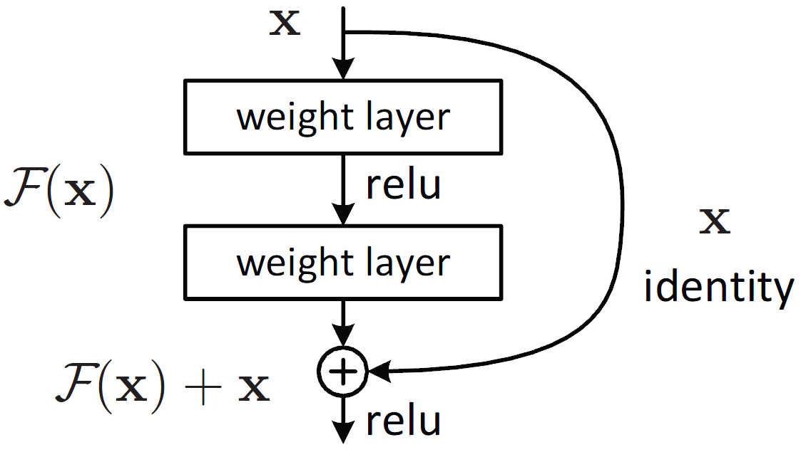

# 实验报告 - pj1H - Part2

## 卷积神经网络

### 1. 代码基本结构

本实验的目的是使用卷积神经网络对手写汉字进行分类。代码主要由以下几个部分组成：

- **模型定义** (`model.py`): 包含了两种模型的实现，一个是基本的CNN模型，另一个是使用残差块的ResNet模型。
- **数据处理** (`dataset.py`): 实现了`HandwrittenChineseDataset`类，用于加载和预处理手写汉字数据。
- **训练脚本** (`train.py`): 包含模型训练的完整流程，从数据加载到模型训练再到验证。
- **测试脚本** (`test.py`): 用于模型的测试，加载测试数据和模型，计算测试损失和准确率。
- **运行入口** (`run.py`): 解析命令行参数，并根据用户选择的模式（训练或测试）执行相应的功能。

### 2. 网络结构设计与理解

#### CNN模型
```python
class CNN(nn.Module):
    def __init__(self):
        super(CNN, self).__init__()
        self.conv1 = nn.Conv2d(1, 16, kernel_size=5, stride=1, padding=2)
        self.pool = nn.MaxPool2d(kernel_size=2, stride=2)
        self.conv2 = nn.Conv2d(16, 32, kernel_size=5, stride=1, padding=2)
        self.fc1 = nn.Linear(32 * 7 * 7, 120)
        self.dropout = nn.Dropout(0.5)
        self.fc2 = nn.Linear(120, 84)
        self.fc3 = nn.Linear(84, 12)
    
    def forward(self, x):
        x = self.pool(F.relu(self.conv1(x)))
        x = self.pool(F.relu(self.conv2(x)))
        x = x.view(-1, 32 * 7 * 7)
        x = self.dropout(F.relu(self.fc1(x)))
        x = F.relu(self.fc2(x))
        return self.fc3(x)
```
- **第一层卷积层**: 使用16个5x5的卷积核，步长为1，边缘填充为2，后接一个2x2的最大池化层。
- **第二层卷积层**: 使用32个5x5的卷积核，步长为1，边缘填充为2，同样后接一个最大池化层。
- **全连接层**: 展平后的数据通过两个全连接层进行处理，最后输出12个类别的预测结果。

这个模型主要参考了Lenet的设计，其中增加了dropout的设计，将在后续讨论防止过拟合手段处详细讲解。

#### ResNet模型

传统的深度神经网络在堆叠多个层时，存在着梯度消失和梯度爆炸的问题。当网络变得很深时，这些问题会导致训练变得非常困难。残差网络通过引入残差连接（residual connections）来解决这些问题。残差连接允许信息在跳跃式的路径上传播，使得网络可以更轻松地学习到恒等映射，即学习到将输入直接映射到输出的变换，而不需要额外地学习复杂的映射。

在残差网络中，一个残差块由两个主要部分组成：恒等映射（identity mapping）和残差映射（residual mapping）。恒等映射代表了从输入到输出的直接映射，而残差映射则表示了需要学习的残差部分。这两部分被加在一起，形成了残差块的输出。

设输入为 $ x $，残差块的输出为 $ F(x) $，则残差块的计算可以表示为：

$$ F(x) = H(x) + x $$

其中，$ H(x) $ 表示残差映射，$ x $ 表示输入，$ + $ 表示元素级的相加操作。
```python
class ResNet(nn.Module):
    def __init__(self, block, num_blocks, num_classes=12, dropout_rate=0.0):
        super(ResNet, self).__init__()
        self.in_channels = 64
        self.conv1 = nn.Conv2d(1, 64, kernel_size=7, stride=2, padding=3, bias=False)
        self.bn1 = nn.BatchNorm2d(64)
        self.layer1 = self._make_layer(block, 64, num_blocks[0], stride=1, dropout_rate=dropout_rate)
        self.layer2 = self._make_layer(block, 128, num_blocks[1], stride=2, dropout_rate=dropout_rate)
        self.layer3 = self._make_layer(block, 256, num_blocks[2], stride=2, dropout_rate=dropout_rate)
        self.layer4 = self._make_layer(block, 512, num_blocks[3], stride=2, dropout_rate=dropout_rate)
        self.linear = nn.Linear(512 * block.expansion, num_classes)

    def forward(self, x):
        out = F.relu(self.bn1(self.conv1(x)))
        out = self.layer1(out)
        out = self.layer2(out)
        out = self.layer3(out)
        out = self.layer4(out)
        out = F.adaptive_avg_pool2d(out, (1, 1))
        out = out.view(out.size(0), -1)
        return self.linear(out)
```
- **初始层**: 一个7x7的卷积层，输出通道数为64，步长为2，后接批量归一化和ReLU激活函数，以及3x3的最大池化层。
- **残差块**: 四组残差块，每组使用不同数量的输出通道（64, 128, 256, 512），每个块中卷积层后有批量归一化和ReLU激活函数。
- **输出层**: 全局平均池化后接一个全连接层，输出12个类别的预测结果。
- **batch normalization**：网络中多处用到了`bn`这个函数。Batch Normalization（批归一化）是一种用于加速深度神经网络训练和提高模型性能的技术。它的主要思想是通过在网络的每个层的激活函数之前对每个 mini-batch 进行归一化操作，从而使得网络对输入数据的分布更加稳定，减少了内部协变量偏移（Internal Covariate Shift）。


具体来说，对于一个具有 m 个样本的 mini-batch，假设某一层的输入为 $ x = \{x_1, x_2, ..., x_m\} $，则 Batch Normalization 的计算过程可以表示为：

1. 计算 mini-batch 的均值 $ \mu $ 和方差 $ \sigma^2 $：

$$ \mu = \frac{1}{m} \sum_{i=1}^{m} x_i $$

$$ \sigma^2 = \frac{1}{m} \sum_{i=1}^{m} (x_i - \mu)^2 $$

2. 对 mini-batch 进行归一化：

$$ \hat{x}_i = \frac{x_i - \mu}{\sqrt{\sigma^2 + \epsilon}} $$

其中 $ \epsilon $ 是一个很小的常数，用于防止除以零的情况。

3. 进行缩放和位移操作：

$$ y_i = \gamma \hat{x}_i + \beta $$

其中 $ \gamma $ 和 $ \beta $ 是可学习的参数，用于对归一化后的数据进行缩放和平移，使得网络可以学习到适合当前任务的特征表示。

这个模型的设计使用的是Resnet18，也就是Resnet中最为基础的模型。

#### 残差块BasicBlock
```python
class BasicBlock(nn.Module):
    expansion = 1

    def __init__(self, in_channels, out_channels, stride=1, dropout_rate=0.0):
        super(BasicBlock, self).__init__()
        self.dropout_rate = dropout_rate
        # 第一个卷积层
        self.conv1 = nn.Conv2d(in_channels, out_channels, kernel_size=3, stride=stride, padding=1, bias=False)
        self.bn1 = nn.BatchNorm2d(out_channels)
        # 第二个卷积层
        self.conv2 = nn.Conv2d(out_channels, out_channels, kernel_size=3, stride=1, padding=1, bias=False)
        self.bn2 = nn.BatchNorm2d(out_channels)
        self.dropout = nn.Dropout(p=dropout_rate)

        self.shortcut = nn.Sequential()
        if stride != 1 or in_channels != self.expansion * out_channels:
            self.shortcut = nn.Sequential(
                nn.Conv2d(in_channels, self.expansion * out_channels, kernel_size=1, stride=stride, bias=False),
                nn.BatchNorm2d(self.expansion * out_channels)
            )

    def forward(self, x):
        out = F.relu(self.bn1(self.conv1(x)))
        out = self.dropout(out)
        out = self.bn2(self.conv2(out))
        out += self.shortcut(x)
        out = F.relu(out)
        return out
```
- **卷积层** (`self.conv1` 和 `self.conv2`):
   - 第一个卷积层使用了`kernel_size=3`, `stride=stride`, 和 `padding=1`。这样的设置使得卷积操作后的输出保持与输入相同的空间维度（如果步长为1）。
   - 第二个卷积层也使用相同的核大小和填充，但步长固定为1，目的是进一步提取特征而不改变特征图的尺寸。

- **批量归一化** (`self.bn1` 和 `self.bn2`):
   - 对卷积层的输出进行归一化处理，有助于加速收敛速度，同时使模型对初始化方式不那么敏感。

- **跳跃连接** (`self.shortcut`):
   - 如果输入和输出的维度不匹配（由于卷积步长不为1或者输入输出通道数不同），则通过一个1x1的卷积层调整维度，以确保跳跃连接的输入能和块内的输出相加。
   - 1x1卷积不仅可以调整维度，还可以在不增加太多参数的前提下增加网络的非线性。

### 3. 防止过拟合的手段
本次实验中主要使用了两种方法来防止过拟合：数据增强和网络dropout。数据增强是利用`transform`模块实现的：
#### 数据增强方法

```python
transform_train = transforms.Compose([
    transforms.RandomRotation(5),  # 随机旋转
    transforms.RandomAffine(degrees=0, scale=(0.9, 1.1), translate=(0.1, 0.1)),  # 随机仿射变换
    transforms.ToTensor(),  # 将图片转换为Tensor
    transforms.Normalize((0.5,), (0.5,))  # 归一化
])
```

1. **随机旋转** (`RandomRotation`):
   - 这一步随机将图像旋转一个在[-5, 5]度之间的角度。旋转可以帮助模型学习到从不同角度观察手写汉字时的不变性，从而增强模型对旋转扰动的鲁棒性。

2. **随机仿射变换** (`RandomAffine`):
   - 这一步不进行旋转（`degrees=0`），但通过随机缩放（`scale=(0.9, 1.1)`）和平移（`translate=(0.1, 0.1)`）对图像进行变换。这些变换模仿了图片在现实世界中可能遇到的尺度变化和位置偏移，有助于增强模型对这类自然变化的适应能力。

3. **归一化** (`Normalize`):
   - 这一步使用均值0.5和标准差0.5对数据进行归一化。归一化有助于模型训练过程中的数值稳定性，加快收敛速度。它确保了输入数据在各个特征维度上具有相似的分布，这可以减少一些层中的学习偏差。

#### Dropout方法
Dropout是一种常用的正则化技术，通过在训练过程中随机丢弃（或者说关闭）一部分神经元，来防止模型过拟合。这样做的目的是，通过减少神经元之间的相互依赖关系，强制网络去学习更加鲁棒的特征表示，提高模型的泛化能力。

在我的代码中，在CNN和ResNet模型中都加入了dropout的设计，增加模型的鲁棒性和泛化能力。

### 效果分析

实际上，这些数据增强的手段在我本次的实验中没有显现出特别明显的效果。在CNN模型上对比不使用防过拟合、使用数据增强、使用数据增强+dropout手段，三者最终达到的准确率非常接近，都在98%附近，其中不使用任何防过拟合手段反而能得到更快的收敛，只需要20～30个epoch就能达到最佳效果。我猜测其中的主要原因是该任务的难度较低，能够比较轻易达到98%正确率，因此这些手段都很难在结果中体现出作用。对于Resnet18来说，由于模型的参数量较大，防止过拟合依然是为了得到稳定结果比较重要的一环。

### 4. 实验结过程与优化

在模型的设置上，由于Resnet18是一个比较成熟且稳定的模型，因此对于它的参数设置我没有做进一步的改动。在CNN中，我在原始Lenet的基础上做了一些尝试。我尝试修改了前两个卷积层的通道数，以及尝试在全连接层中删除一层的效果。我也尝试了将一个卷积核的大小改为3*3，企图得到不同感受野的信息。最终我选择将两层卷积的通道数改为16和32，保持原有的全连接层，得到一个比原始版本稍强的卷积网络。

在训练过程中，通过设置不同的超参数（如批大小、学习率等）和采用不同的优化策略（如学习率衰减），对模型进行了优化。经过反复尝试后，我发现`batch size`=32是一个比较合理的选择，其中Resnet要使用比普通卷积网络更小的学习率。同时我也引入了`lr_decay`得到更稳定的结果。最后使用的参数和结果如下：
**CNN**:
```
batch_size = 32
learning_rate = 0.002
lr_decay = {
    'factor': 0.9, 
    'interval': 10
}
epochs = 100
```
实验结果：Acc = 98.2%
**Resnet**:
```
batch_size = 32
learning_rate = 0.001
lr_decay = {
    'factor': 0.9, 
    'interval': 10
}
epochs = 80
```
实验结果：Acc = 99.2%
